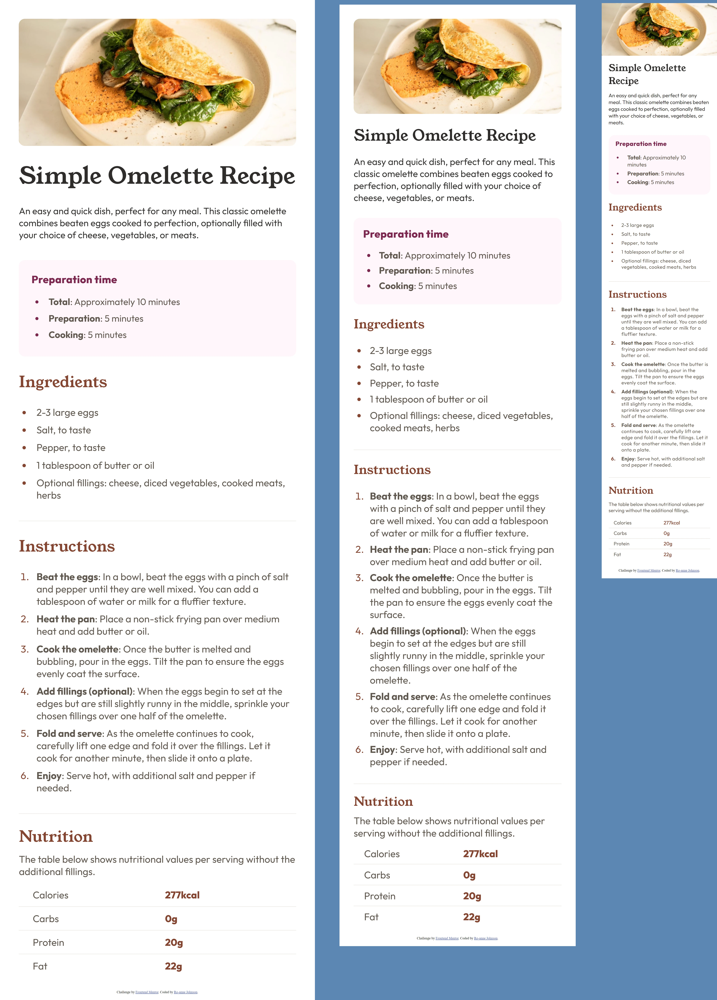

# Frontend Mentor - Recipe page solution

This is a solution to the [Recipe page challenge on Frontend Mentor](https://www.frontendmentor.io/challenges/recipe-page-KiTsR8QQKm). Frontend Mentor challenges help you improve your coding skills by building realistic projects. 

## Table of contents

- [Overview](#overview)
  - [Screenshot](#screenshot)
  - [Links](#links)
- [My process](#my-process)
  - [Built with](#built-with)
- [Author](#author)

## Overview

### Screenshot

### Links

- Solution URL: [Add solution URL here](https://roannej.github.io/recipe-page/)

## My process
Built working in tandem on mobile & desktop
Eye-balled jpeg design sample (comprehensive design spec not available)

### Built with

- HTML5
- CSS

## Author

- Website - [Ro-anne Johnson](https://roannej.github.io/recipe-page/)
- Frontend Mentor - [@Roannej](https://www.frontendmentor.io/profile/yourusername)
